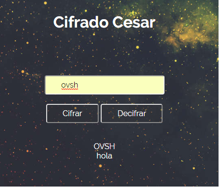
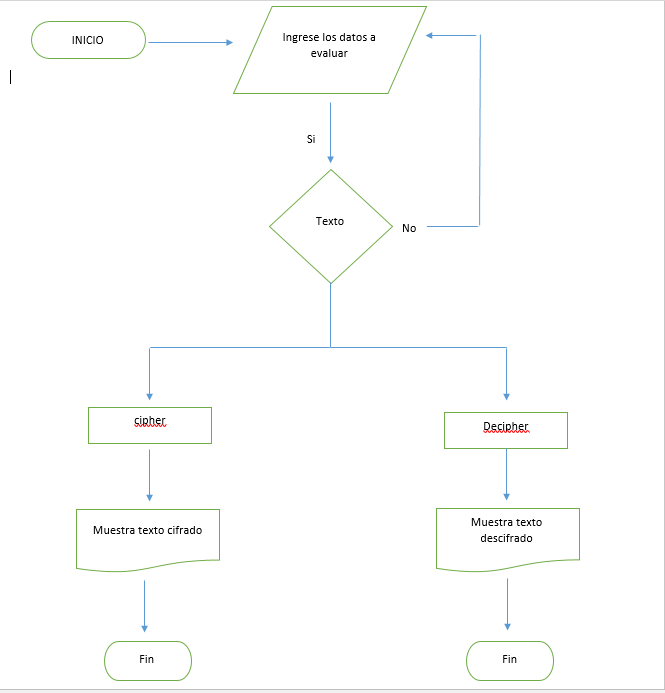

# Cifrado César con ES6

Creación de la aplicación cifrado césar con 33 espacios hacia la derecha en Es6.

* Texto original: hola
* Texto codificado: ovsh

## Muestra

## Diagrama de flujo

## Herramientas Utilizadas
* Framework Bootstrap
* Jquery
* Html 5
* Css 3
* Javascript Es6

## Bibliografía

* <http://getbootstrap.com/docs/3.3/components/>
* <https://carlosazaustre.es/ecmascript-6-el-nuevo-estandar-de-javascript/>
* <https://desarrolloweb.com/articulos/arrow-functions-es6.html>
* <https://medium.com/laboratoria-how-to/funciones-y-es6-arrow-functions-871c2c6b06b1>
